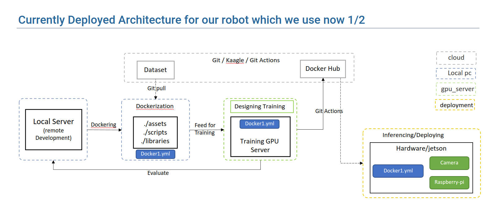

# Architecture of ML_Ops with Deep Learning Inference & ROS Architecture


## Introduction:



This project is to develop a ML-Ops implementation with deep learning model sfa3d and inference with ROS (Robotic Operating System).

## Usage:
To Implement this model:

### Steps to implement:

1. Create docker image
```
docker build . -t <name:tag> 
```

2. Training model
```
docker run -it --gpus 1 <name:tag> <script/model_train.py>
```

3. Inference the model
```
docker run -it --rm --privileged --env="DISPLAY" --volume="/tmp/.X11-unix:/tmp/.X11-unix:rw" --device="/dev/video0:/dev/video0" cdl:socks_storing2 python3 inference/only_camera_inference.py
```
